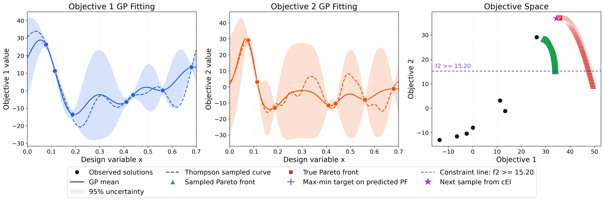

# STAGE-BO

Code for the paper *Multi-Objective Bayesian Optimization via Adaptive* $\varepsilon$-*Constraints Decomposition*.

ArXiv: [2604.15959](https://arxiv.org/abs/2604.15959)


**Figure 1.** Illustration of STAGE-BO. 

## Overview

STAGE-BO is a multi-objective Bayesian optimization method that:

- fits independent Gaussian process models for each objective, shown in the left and middle panels of Figure 1
- draws Thompson samples from those posteriors, shown as dashed curves
- uses NSGA-II to extract a sampled Pareto front, shown as green points in the right panel
- selects the largest uncovered gap relative to the observed front, shown as the purple cross
- converts that target into an adaptive $\varepsilon$-constraint subproblem, illustrated by the horizontal constraint line
- proposes the next evaluation with constrained expected improvement, shown as the purple star

This repository contains the code for three settings:

- `unconstrained`: standard multi-objective optimization
- `preference`: optimization restricted to a preference region
- `constrained`: optimization with explicit feasibility constraints

The unconstrained and preference-based settings share the same core algorithm. The preference-based setting adds a user-provided region of interest in objective space.

## Repository Layout

```text
STAGE-BO/
  scripts/
    run_method.py
  src/
    algorithms/
    models/
    problems/
    solvers/
    config.py
    runner.py
    runtime.py
  tests/
```

## Installation

```bash
pip install -e .
```

## Running Experiments

The main entry point is:

```bash
python scripts/run_method.py --problem <name> --mode <mode> --steps <n>
```


### Unconstrained

```bash
python scripts/run_method.py \
  --problem ZDT1_10 \
  --mode unconstrained \
  --steps 20
```

Problems used in the paper for this setting include:
`ZDT1_10`, `ZDT2_8`, `DTLZ7_5`, `coil-spring`, `rocket-injector`, `water-planning`

### Preference-Based

```bash
python scripts/run_method.py \
  --problem ZDT3 \
  --mode preference \
  --steps 20 \
  --pref-lower -0.7 -0.6 \
  --pref-upper -0.2 -0.4
```

Problems used in the paper for this setting include:
`ZDT3`, `DTLZ2_5`, `VehicleSafety`, `CarSideImpact`

### Constrained

```bash
python scripts/run_method.py \
  --problem CONSTR \
  --mode constrained \
  --steps 20
```

Problems used in the paper for this setting include:
`MW7_4`, `CONSTR`, `con-gear-train-design`, `con-disc-brake-design`

## Outputs

Results are written to:

```text
outputs/<mode>/<problem>/seed_<seed>/
```

Each run saves:

- the evaluated design points
- the observed objective values
- constraint values for constrained runs
- the approximated true Pareto front used for metrics
- per-iteration history
- the run configuration

During execution, the solver also prints one JSON line per iteration with:

- `iteration`
- `hv`
- `igd`
- `igd_plus`

At the end of the run, the script prints a final JSON summary with the output directory, number of iterations, and final metrics.

## Citation

If this repository is useful in your research, please cite:

```bibtex
@article{yang2026multi,
  title={Multi-Objective Bayesian Optimization via Adaptive $\varepsilon$-Constraint Decomposition},
  author={Yang, Yaohong and Katt, Sammie and Kaski, Samuel},
  journal={International Conference on Machine Learning},
  year={2026}
}
```
